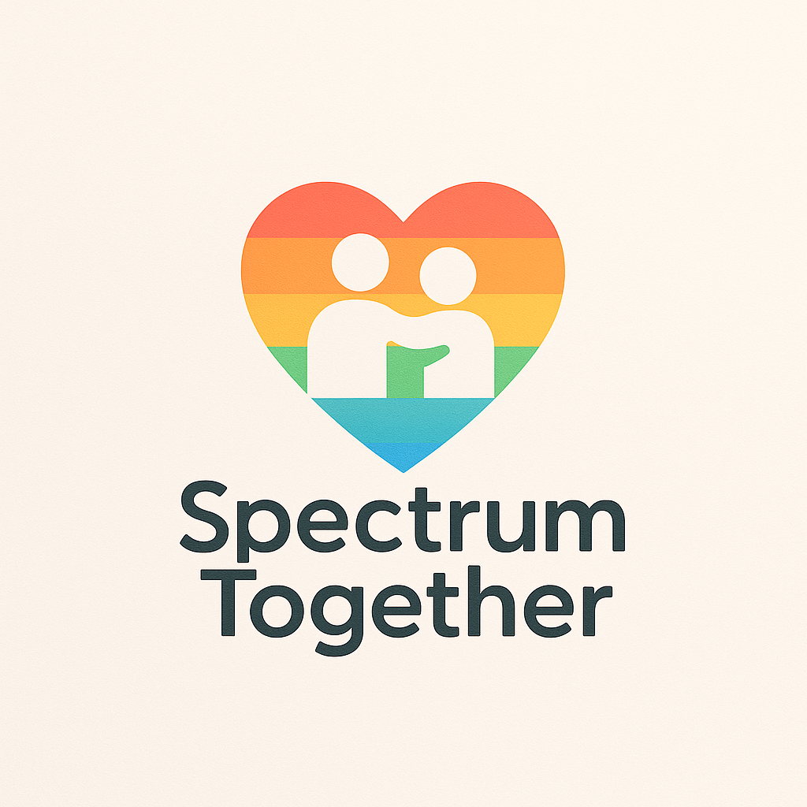

<h1 align="center">
  <a href="https://spectrumtogether.org" target="_blank" rel="noopener noreferrer">
     
    SpectrumTogether
  </a>
</h1>

<em>
  An open space for collaboration, inclusion, and autism-friendly tools.
</em>

  
  

---

## 💡 About

**SpectrumTogether** is a community-driven initiative focused on developing inclusive, open-source tools, platforms, and digital resources for children, families, and educators in the autism spectrum community.

Our projects prioritize:

- 🌈 Accessibility and neurodiversity
- 🤝 Collaboration between developers, parents, and educators
- 🧠 Empowerment through technology
- 💬 Multilingual and inclusive interfaces

---

## 📁 Featured Projects

| Project | Description |
|--------|-------------|
| [`spectrum-ui`](https://github.com/SpectrumTogether/spectrum-ui) | Reusable UI components optimized for autism-friendly apps |
| [`spectrum-chat`](https://github.com/SpectrumTogether/spectrum-chat) | A communication app designed for kids on the spectrum |
| [`spectrum-schedule`](https://github.com/SpectrumTogether/spectrum-schedule) | Visual daily schedule builder with reminders & icons |
| ... | More to come! Contributions welcome 🤍 |

---

## 🌐 Platform Links

| Platform | Link |
|---------|------|
| Website | [https://SpectrumTogether.org](https://SpectrumTogether.org) |
| GitHub | [github.com/SpectrumTogether](https://github.com/SpectrumTogether) |
| Docs | [docs.SpectrumTogether.org](https://docs.spectrumtogether.org) |
| Blog | [blog.SpectrumTogether.org](https://blog.spectrumtogether.org) |
| Community Forum | [community.SpectrumTogether.org](https://community.spectrumtogether.org) |

---

## 🤲 Contributing

We welcome **collaborators**, **educators**, **parents**, and **developers** to join us!

- 🛠️ Submit issues or feature requests
- 🌍 Help with accessibility, translations, and testing
- 📚 Share your experience or suggestions in Discussions

> Let’s build a better future, together. ❤️

---

## 📜 License

All projects are released under the **MIT License** unless otherwise stated.  
© 2025 [SpectrumTogether.org](https://spectrumtogether.org) – All rights reserved.
